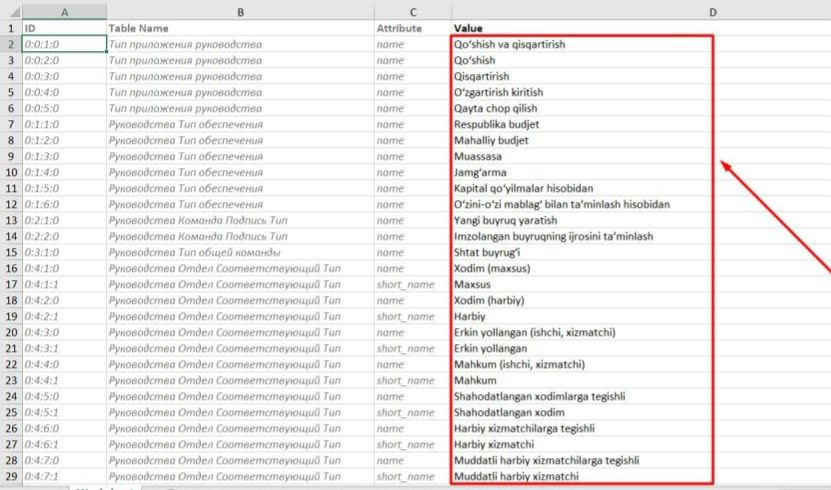
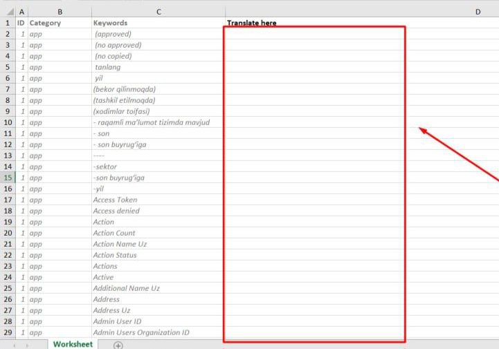

multilingual
===========================

Multilingual package for Yii2 projects
> Note: This package translates dynamic data in the project's Database.
>

Installation
------------

Either run

```sh
composer require yunusbek/multilingual
```

or add

```json
"yunusbek/multilingual": "^1.0",
```

to the require section of your composer.json.

Usage
------------

Once the library is installed, add the following to your project settings:

```php
# Add the following code to controllerMap
[
    #...
    'controllerMap' => [
        'multilingual-migration' => 'Yunusbek\Multilingual\commands\Migrations',
    ],
    #...
]
```

The next thing you need to do is updating your database schema by applying the migration of table ```language_list```:

```sh
php yii multilingual-migration/generate
```

The next important processing steps in the project settings.

```php
# params.php
[
    #...
    'language_list' => [
        'en' => [
            'name' => 'Default language', # Enter the current default language in your project.
            'short_name' => 'Def', # Enter the current default language short name.
            'image' => '/path/to/default/language/flag.jpg', # Enter the path to the current default language flag image. 
            'active' => false,
        ]
    ],
    #...
]

# for yii2 basic - config/web.php
# for yii2 advanced - config/main.php
[
    #...
    'bootstrap' => ['log', function () {
        Yii::$app->params['language_list'] = \Yunusbek\Multilingual\models\LanguageManager::getAllLanguages('lang'); # The "lang" parameter is a key to Yii::$app->session->set('lang', 'selected_language_key').
    }],
    #...
    'modules' => [
        'multilingual' => [
            'class' => Yunusbek\Multilingual\Module::class,
        ],
    ]
    #...
]
```
> Note: To save this ```Yii::$app->session->set('lang', 'selected_language_key');``` session, add the following action to ```BaseController```;
> 

```php
    public function actionSelectLang($lang): Response
    {
        Yii::$app->session->set('lang', $lang);
        Yii::$app->language = $lang;
        return $this->redirect(Yii::$app->request->referrer);
    }
```

Inheritance from the ```BaseLanguageList``` class and additional settings for the class created for the ```language_list``` table:
Create a class (model) for the ```language_list``` table that extends the ```BaseLanguageList``` class, and add additional rules to the ```rules()``` method:

````php
use Yunusbek\Multilingual\models\BaseLanguageList

class LanguageList extends BaseLanguageList
{
    public static function tableName()
    {
        return 'language_list';
    }

    public function rules()
    {
        return array_merge(parent::rules(), [
            #...self rules of model
        ]);
    }
}
````
Then, generate CRUD for the completed model and add a new language.
>All added dynamic languages are stored as an array in the ```Yii::$app->params['language_list']``` variable. You can extract languages from this variable to use them in the navbar.
> 
>

The models to be translated are inherited from the ```Multilingual``` model.

```php
use Yunusbek\Multilingual\models\Multilingual;

class ReferenceModel extends Multilingual
{
    #...model settings.
}
```

The part to be applied in the form page:

```php
<?php $form = ActiveForm::begin(); ?>
    #...
    <?php echo \Yunusbek\Multilingual\widgets\MultilingualAttributes::widget([
        'form' => $form,
        'model' => $model,
        'attribute' => 'attribute_name', # or add multiple like ['attribute_name', 'second_attribute_name']
    ]) ?>
    #...
<?php ActiveForm::end(); ?>
```
> All added languages will automatically be displayed on the form page. From here you can type in the translation of all your newly added languages.
>1) Default language;
>2) Newly added language;
>
>


Necessary additions
===========================

>Not only can you translate new languages one by one on the form page, but you can also do it by translating a single Excel file in bulk.

Useful buttons to install
------------
Add the following button to the top of the created CRUD index page which will take you to the general translations page.

````php
echo Html::a('All translations', ['/multilingual/language/index'], ['class' => 'btn btn-primary', 'target' => '_blank']);
````

and add the following button to the actions section of each language row, which will download an excel file of all translations for that language.

````php
echo Html::a('image .'" height="16"> '.Yii::t('app', 'Export Excel'), ['/multilingual/language/export-to-excel', 'table_name' => $model->table], ['class'=> 'btn btn-info', 'data-pjax' => '0'])
````


Instruction manual
------------

This is an Excel file downloaded from an existing language



This is a translated Excel file for the language that needs to be added.



> When adding a new language, you can save the path of the translated excel file above to the ```import_excel``` attribute in the ```language_list``` table.
> 
> Result: all translations for the newly added language will be saved, automatically saved from the Excel file to the new ```lang_*``` table.
>

Result:
------------


